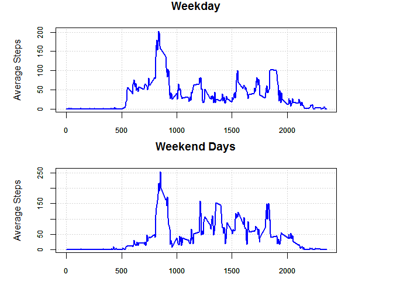

# Reproducible Research: Peer Assessment 1

## Loading and preprocessing the data


### Read in the file and tidy the data.

```r
steps <- read.table("activity.csv", header=TRUE, sep=",")
steps$date <- as.Date(steps$date)
```

## What is mean total number of steps taken per day?

```r
step.days <- aggregate(steps ~ date, steps, sum, rm.na=TRUE)
```

### The Totals by Day

```r
step.days
```

```
##          date steps
## 1  2012-10-02   127
## 2  2012-10-03 11353
## 3  2012-10-04 12117
## 4  2012-10-05 13295
## 5  2012-10-06 15421
## 6  2012-10-07 11016
## 7  2012-10-09 12812
## 8  2012-10-10  9901
## 9  2012-10-11 10305
## 10 2012-10-12 17383
## 11 2012-10-13 12427
## 12 2012-10-14 15099
## 13 2012-10-15 10140
## 14 2012-10-16 15085
## 15 2012-10-17 13453
## 16 2012-10-18 10057
## 17 2012-10-19 11830
## 18 2012-10-20 10396
## 19 2012-10-21  8822
## 20 2012-10-22 13461
## 21 2012-10-23  8919
## 22 2012-10-24  8356
## 23 2012-10-25  2493
## 24 2012-10-26  6779
## 25 2012-10-27 10120
## 26 2012-10-28 11459
## 27 2012-10-29  5019
## 28 2012-10-30  9820
## 29 2012-10-31 15415
## 30 2012-11-02 10601
## 31 2012-11-03 10572
## 32 2012-11-05 10440
## 33 2012-11-06  8335
## 34 2012-11-07 12884
## 35 2012-11-08  3220
## 36 2012-11-11 12609
## 37 2012-11-12 10766
## 38 2012-11-13  7337
## 39 2012-11-15    42
## 40 2012-11-16  5442
## 41 2012-11-17 14340
## 42 2012-11-18 15111
## 43 2012-11-19  8842
## 44 2012-11-20  4473
## 45 2012-11-21 12788
## 46 2012-11-22 20428
## 47 2012-11-23 21195
## 48 2012-11-24 14479
## 49 2012-11-25 11835
## 50 2012-11-26 11163
## 51 2012-11-27 13647
## 52 2012-11-28 10184
## 53 2012-11-29  7048
```

### Histogram of Steps Per Day

```r
steps.mean <- round(mean(step.days$steps),1)
steps.median <- round(median(step.days$steps),1)
steps.sd <- round(sd(step.days$steps), 1)

hist(step.days$steps, breaks=20, xlab="", ylab="", main="Histogram of Steps Per Day")
axis(1, tck=1, lty=3, col="lightgray")
axis(2, tck=1, lty=3, col="lightgray")
hist(step.days$steps, breaks=20, col="lightgreen", lwd=3, add=TRUE)
axis(1, lty=3, col="black")
axis(2, lty=3, col="black")
```

 

### Compute the Mean and the Median

```r
print(paste0("Mean = ", steps.mean, ", Median = ", steps.median))
```

```
## [1] "Mean = 10767.2, Median = 10766"
```

## What is the average daily activity pattern?

```r
step.intervals <- aggregate(steps ~ interval, steps, mean, rm.na=TRUE)
step.intervals$steps <- round(step.intervals$steps, 1)
plot(step.intervals$interval, step.intervals$steps, type="n", xlab="Interval", ylab="Average Steps", main="Average Steps Per Interval")
axis(1, tck=1, lty=3, col="lightgray")
axis(2, tck=1, lty=3, col="lightgray")
lines(step.intervals$interval, step.intervals$steps, col="blue", lwd=2)
axis(1, lty=3, col="black")
axis(2, lty=3, col="black")
```

 

### Find the interval with the highest daily average

```r
max.steps <- step.intervals$steps[1]
max.interval <- step.intervals$interval[1]

for (i in 2:nrow(step.intervals)) {
    if (step.intervals$steps[i] > max.steps) {
        max.steps <- step.intervals$steps[i]
        max.interval <- step.intervals$interval[i]
    }
}

print(paste0("Max Average Steps = ", max.steps, ", At Interval = ", max.interval))
```

```
## [1] "Max Average Steps = 206.2, At Interval = 835"
```

## Imputing missing values

### Create a new dataset "NA.steps" from "steps" by imputing the NA values.

```r
imputed.steps <- steps
total.missing <- 0

for (i in 1:nrow(imputed.steps)) {
    
    # If the interval is an NA, the look up the mean for the 5 minute interval (we computed this 
    # earlier) and increment the counter keeping track of the total number of NA's.
    
    if (is.na(imputed.steps$steps[i])) {
        j <- which(step.intervals$interval == imputed.steps$interval[i])
        imputed.steps$steps[i] <- step.intervals$steps[j]
        total.missing <- total.missing + 1
    }
}
```

### Number of rows with missing steps (i.e., NA's)

```r
print(paste0("Total Missing Rows = ", total.missing))
```

```
## [1] "Total Missing Rows = 2304"
```


```r
imputed.step.days <- aggregate(steps ~ date, imputed.steps, sum)
```

### Histogram of Imputed Steps Per Day

```r
hist(imputed.step.days$steps, breaks=20, xlab="Imputed Steps Per Day", 
     main="Histogram of Imputed Steps Per Day")
axis(1, tck=1, lty=3, col="lightgray")
axis(2, tck=1, lty=3, col="lightgray")
hist(imputed.step.days$steps, breaks=20, col="lightgreen", lwd=3, add=TRUE)
axis(1, lty=3, col="black")
axis(2, lty=3, col="black")
```

 

### Compute the Mean and the Median of Imputed Data

```r
imputed.steps.mean <- round(mean(imputed.step.days$steps),1)
imputed.steps.median <- round(median(imputed.step.days$steps),1)
                              
print(paste0("Mean = ", imputed.steps.mean, ", Median = ", imputed.steps.median))
```

```
## [1] "Mean = 10766.2, Median = 10766.2"
```

### Differences in mean and median between the raw data (with NA's) and imputed data.

```r
diff.steps.mean <- round(imputed.steps.mean - steps.mean,1)
diff.steps.median <- round(imputed.steps.median - steps.median,1)

print(paste0("Difference in Mean = ", diff.steps.mean, ", Difference in Median = ", diff.steps.median))
```

```
## [1] "Difference in Mean = -1, Difference in Median = 0.2"
```

## Are there differences in activity patterns between weekdays and weekends?

### Create a factor variable in the imputed data frame.


```r
library(lubridate)

# Set the period default to Weekday.

imputed.steps <- cbind(imputed.steps, as.factor(rep("Weekday", times=nrow(imputed.steps))))
names(imputed.steps)[4] <- "period"

levels(imputed.steps$period) <- c("Weekday", "Weekend Days")        # Setup the factor with two levels.
x <- wday(imputed.steps$date) == 6 | wday(imputed.steps$date) == 7  # Find all Saturdays and Sundays.
imputed.steps$period[which(x)] <- "Weekend Days"                    # Set the period to "Weekend Days".
```

### Panel Plot the Weekday and Weekend day  


```r
# This is a common plot function

plot.ss <- function(datasubset) {
    
    ss <- subset(imputed.steps, period == datasubset)                   # Subset the data.
    
    ss.intervals <- aggregate(steps ~ interval, ss, mean, rm.na=TRUE)   # Aggregate the subset by interval.
    ss.intervals$steps <- round(ss.intervals$steps, 1)
    
    # Plot the data.
    
    plot(ss.intervals$interval, ss.intervals$steps, type="n", xlab="Interval", 
        ylab="Average Steps", main=datasubset, xaxt="n", yaxt="n")
    axis(1, tck=1, lty=3, col="lightgray", cex.axis=0.75)
    axis(2, tck=1, lty=3, col="lightgray", cex.axis=0.75)
    lines(ss.intervals$interval, ss.intervals$steps, col="blue", lwd=2, xaxt="n", yaxt="n")
    axis(1, lty=1, col="black", cex.axis=0.75)
    axis(2, lty=1, col="black", cex.axis=0.75)
}

# Start a new panel plot.

plot.new()
par(mfcol=c(2,1), pin=c(5,1.5))               # Setup for two rows, one column for the two plots.
plot.ss("Weekday")              # Plot the average weekday activity by interval.
plot.ss("Weekend Days")         # Plot the average weekend day activity by interval.
```

 
